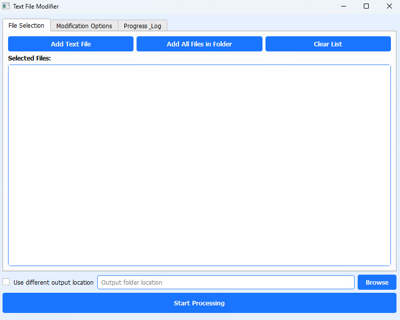
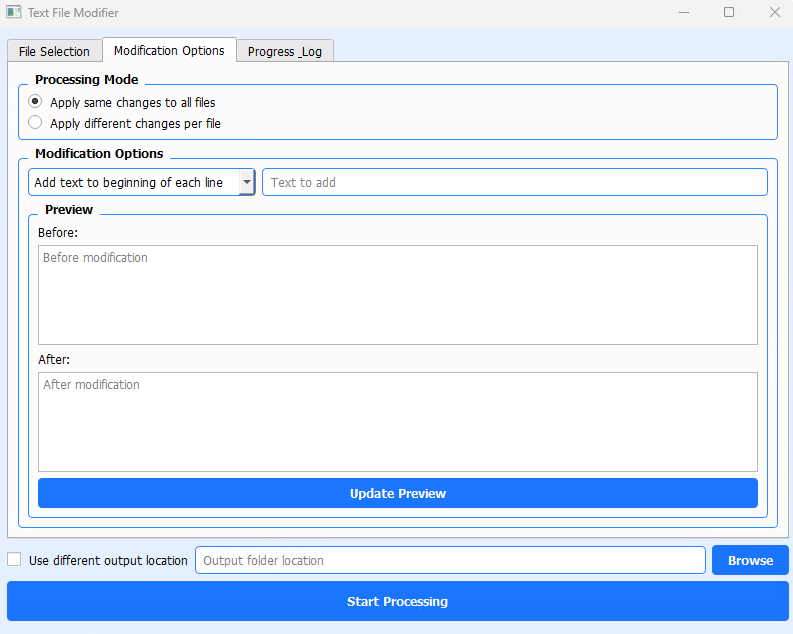
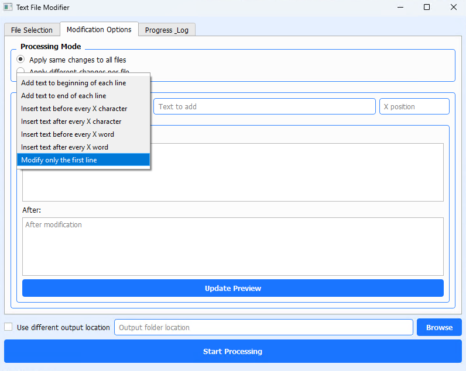

Introducing the "Text-File Modifier" – a versatile tool designed exclusively for Windows users, offering seamless text file editing capabilities. Whether you're a developer, writer, or data analyst, this tool provides an intuitive interface to modify, organize, and manage your text files with ease. With support for a wide array of text formats, the Text-File Modifier ensures that you can handle any file type effortlessly. Enjoy features like batch processing, syntax highlighting, and real-time collaboration, all while maintaining the integrity of your data. Elevate your productivity and streamline your workflow with the Text-File Modifier, your go-to solution for all text editing needs.

